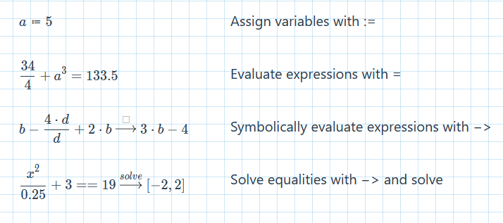

# (Prototype) QuantumSheet

QuantumSheet - A web based computer algebra system aka fancy calculator

[**Try it out here**](https://stefnotch.github.io/quantum-sheet/)

## Looking for collaborators

I would really love to develop this project much further and am looking for collaborators. If you want to give it a shot, just respond here https://github.com/stefnotch/quantum-sheet/issues/14

## Roadmap

[Roadmap](https://github.com/stefnotch/quantum-sheet/projects)

## Used Technology

- [Sympy](https://github.com/sympy/sympy) using [Pyodide](https://github.com/iodide-project/pyodide)
<!-- - [Giac](https://www-fourier.ujf-grenoble.fr/~parisse/giac.html) using an [emgiac fork](https://github.com/brentan/emgiac) -->
<!-- - [Tiptap](https://github.com/scrumpy/tiptap) for text input -->
- [MathLive](https://github.com/arnog/mathlive) for mathematics input
<!-- - Plotting (with https://github.com/gl-vis/gl-plot3d ?) -->
- [Vite](https://github.com/vuejs/vite)

## For Developers

1. Clone the project
2. `npm install`
3. `npm run download:pyodide`
4. `npm run dev`

Check out [CONTRIBUTING.md](https://github.com/stefnotch/quantum-sheet/blob/master/CONTRIBUTING.md) for more

